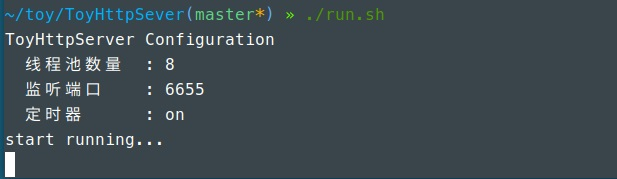
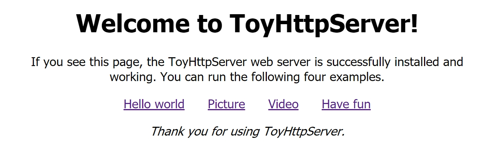
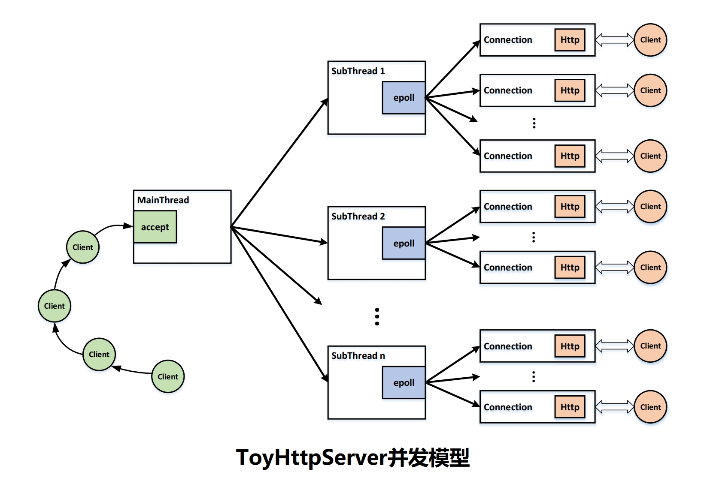
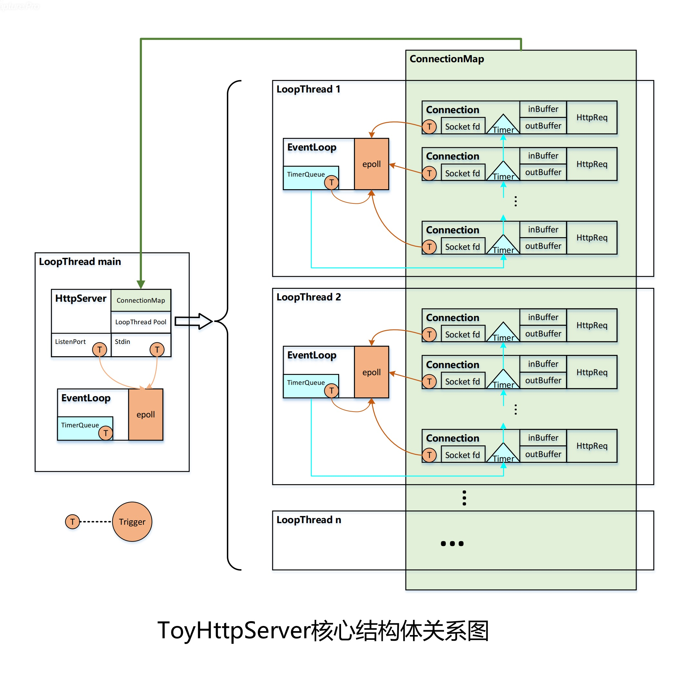
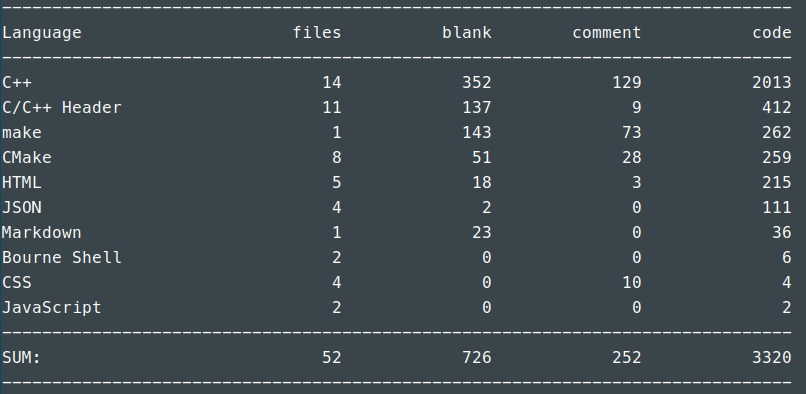

# 多线程高并发HTTP服务器

   

## Introduction
  
    ToyHttpServer是一个使用Modern C++编写的多线程HTTP服务器,主要用于学习Reactor,多线程以及网络编程.

## Build Environment

* OS: Ubuntu 18.04 LTS
* Compiler: g++ 8.2.0

## Build

    cd ToyHttpServer

    ./build.sh

## Quick Start

    ./run.sh

## Run

    cd build/

    ./bin/ToyHttpServer -t [number of threads] -p [port number] -T [on/off]

    在浏览器地址栏中输入ip:port,回车,可看到如下页面

## Usage

    -h             用法.
    -t <num>       线程池数量.
    -p <num>       监听端口.
    -T <on/off>    <打开/关闭>定时器.

## Technical key points

* 采用主线程accept+子线程IO的模型;
* 每个线程使用Reactor模式,通过epoll边沿触发的IO复用实现;
* 子线程采用线程池的方式,充分利用多核CPU;
* 采用基于小根堆实现的定时器,用于关闭超时的连接;
* 采用runInLoop减少锁的争用;
* 采用智能指针等RAII机制避免内存泄露以及实现自动析构;
* 采用状态机解析HTTP请求;
* 支持HTTP传输多种类型的文件,包括html,文本,图像,音视频等;
* 支持运行过程中,输入命令"quit",进行退出运行操作,实现完美析构;

## Concurrency model

    ToyHttpServer采用主线程accept连接,以Round-Robin的方式分发给线程池中的子IO线程.

## Core structure

## Code statistics

