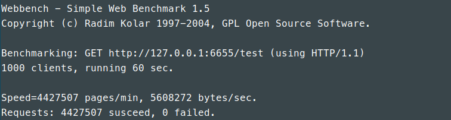
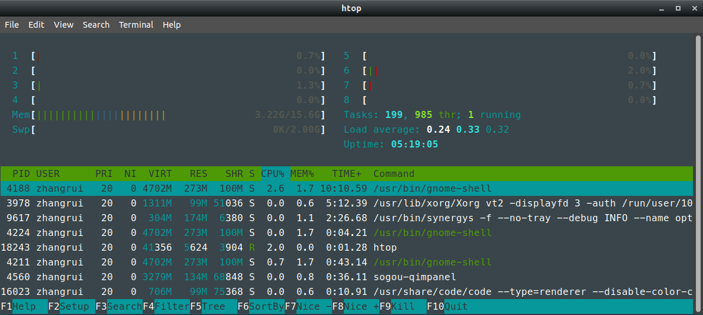
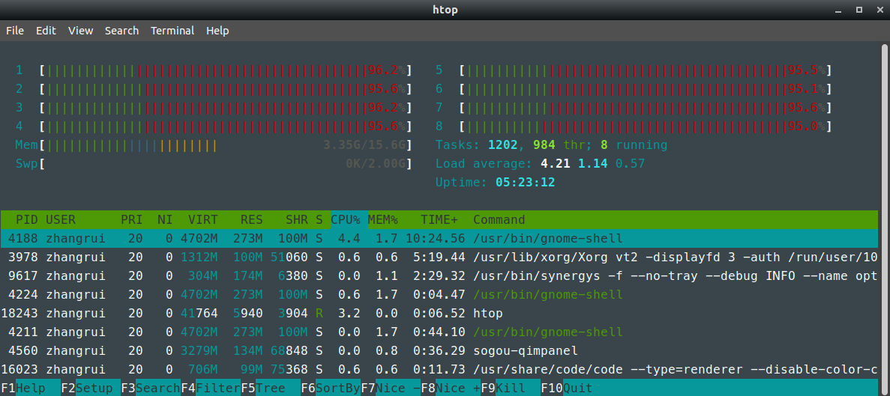

# 测试工具

[webbench](https://github.com/EZLippi/WebBench)

# 测试环境

* OS: Ubuntu 18.04 LTS
* CPU: Intel(R) Core(TM) i7-6700 CPU @ 3.40GHz × 8 
* Memory: 16GB DDR3

# 测试方法

    为避免磁盘IO以及网络带宽的影响,在本地运行webbench,并且使用放置于内存中的字符串进行响应.使用webbench开启1000的线程,测试时间60s.

    ./webbench -t 60 -c 1000 -2 --get  http://127.0.0.1:6655/test

# 测试结果

## webbench结果

## 空载时系统CPU负载

## 满载时系统CPU负载

