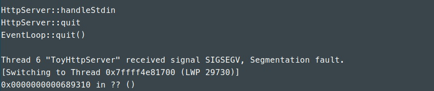
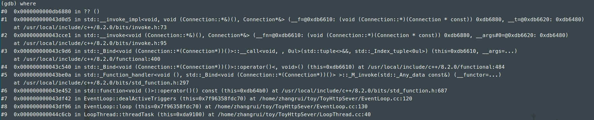

以下是调试过程中遇到的一些有价值的技术问题及其调试过程:

## 一. 实现"完美析构"时core dump问题

### 现象：
    在启动ToyHttpServer之后，如果未运行测试程序（webbench），输入“quit”之后正常退出；如果运行测试程序（webbench）之后，输入“quit”，将产生如下错误；

	
### 调试过程：
	1. 首先使用gdb确定出错位置，一般遇到这种段错误，可以使用core文件进行跟踪；
        a. 使用ulimit -c unlimited命令打开core文件生成；
        b. 复现错误，生成core文件；
        c. 使用gdb ./bin/ToyHttpServer core进入gdb查看core文件；
        d. 在gdb中使用where查看错误产生的地方，如下；

        
		从中可以看出，错误发生在某个子线程的dealActiveTriggers中，而且是在调用回调函数的时候发生的，因此基本可以确定，epoll_wait返回的某个Trigger已经被析构了，导致其存储在event.data.ptr中的自身指针失效，产生段错误；

	2. 拥有Trigger的类型总共有：
        a. HttpServer类中的监听端口的_listen_trigger；
        b. HttpServer类中的标准输入的_stdin_trigger；
        c. 每个EventLoop当中用于唤醒的_wake_trigger；
        d. 每个TimerQueue中的_trigger；
        e. 每个Connection中的_trigger；
        首先不可能是前两类，因为错误发生在子线程中，而a和b是主线程中的Trigger；
        然后也不应该是c和d，因为c和d是EventLoop类的成员变量，必然是先退出loop，然后析构成员变量，最后析构EventLoop，而错误的产生是因为Trigger析构先于loop退出；

	3. 最终定位于Connection中的_trigger过早的析构，此类Trigger仅仅与Connection有关，说明Connection析构导致Trigger析构；

	4. 然后就可以定位到HttpServer中ConnectionMap与LoopThreadPool，由于这两个声明顺序的原因，使得LoopThreadPool先于ConnectionMap析构，导致出现的上面的错误。调换顺序之后，问题解决！

